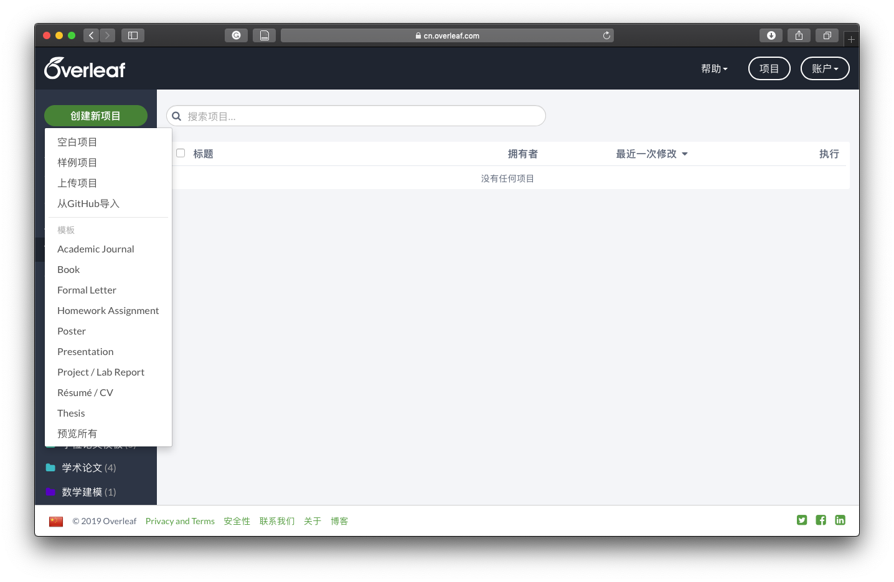
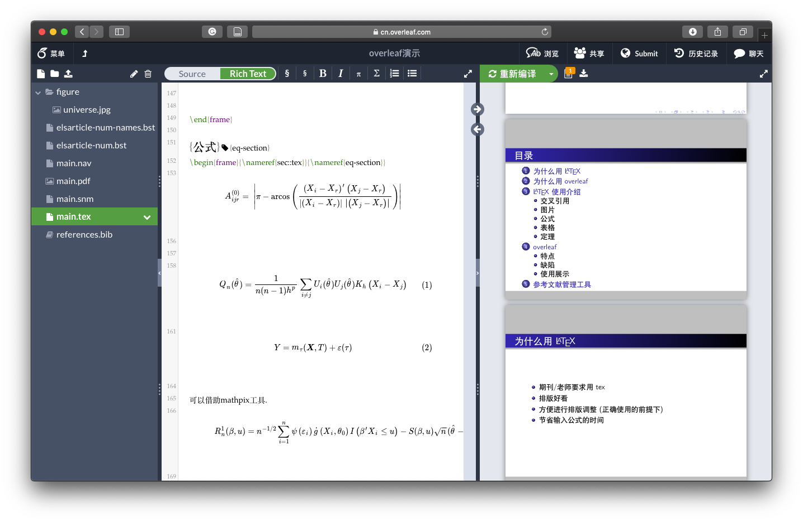
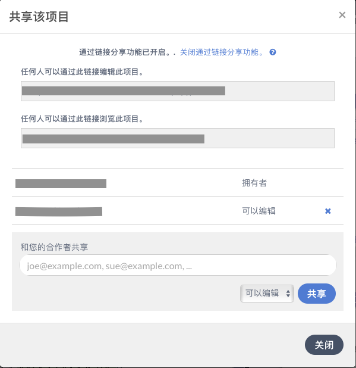
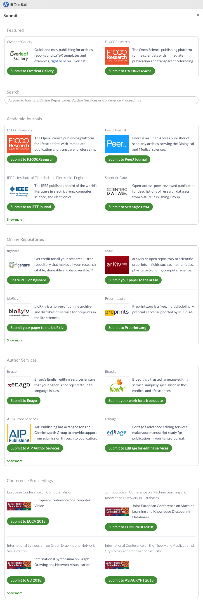

\mainmatter

# Overleaf写作流程 {#intro}

这一章简单介绍在Overleaf中撰写论文的流程.

## 注册账号

https://cn.overleaf.com/project

目前并不能直接注册,需要借助梯子.
但是注册后可以直接访问(但是速度并不是很理想).

## 创建项目

登陆后,在左上角可以看到创建新项目:

空白项目:一个空的项目,没有内容.

示例项目:一个简单示例项目,包含图片、参考文献的插入.

上传项目:我们之前可能有正在写作,还没有完成的项目.只要把所有文件压缩到一个.zip文件,上传即可.

从GitHub导入:

第\@ref(template)章整理了一些发布在GitHub上的tex模板,我们可以直接fork到自己的账户下,然后在Overleaf中选择从GitHub导入.

(需要订阅才能关联GitHub账户)

(不订阅关联账户的话,只需要从GitHub下载.zip再通过上传项目即可)

除此之外,Overleaf提供了丰富的模板资源,可以在这里查看:
https://cn.overleaf.com/latex/templates

## 个人写作

项目建好后,界面和其他的tex客户端几乎没有区别.
左侧是tex的源文件,右侧是生成的pdf文件.

详细的功能介绍在第\@ref(basic)章介绍.

## 添加参考文献

关于参考文献的添加请看\@ref(refe)节.

## 邀请合作者

右上角可以看到一个 **共享** 的功能,点击可以通过链接分享项或者通过账号邀请(免费用户只有1个合作者限制).
接下来就可以一起编写文章.

详细的说明在\@ref(collaborator).

链接分享就是只要通过链接,任何人都可以查看或修改项目.比如在第\@ref(Overleafproject)章,我通过链接分享了一个beamer的示例项目.

## 聊天

右上角有个 **聊天** 功能,主要用于合作者之间交流.这个功能对于我们可能用途不是很大,需要交流的话我们可以选择微信、QQ等其他方式.

## 论文投递

论文写完后,右上角有 submit 功能,可以直接提交到期刊(现在已接入的较少).

当然,也可以下载源文件和pdf,具体请看\@ref(downloadsource)节.

