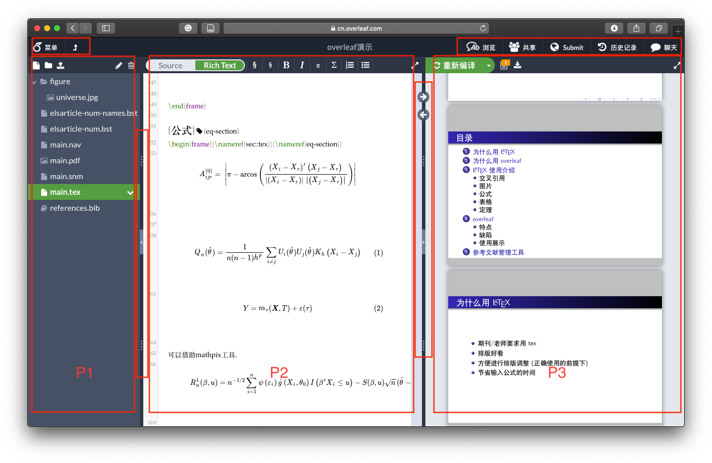
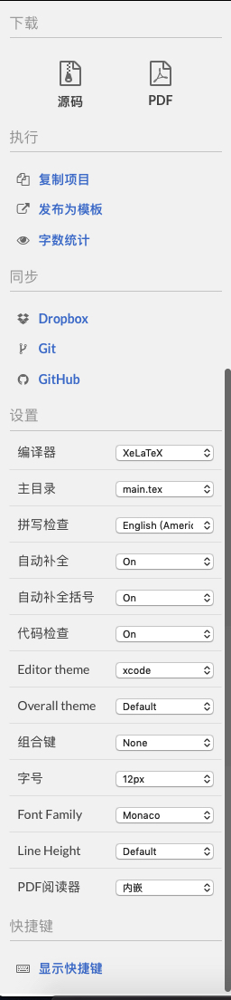
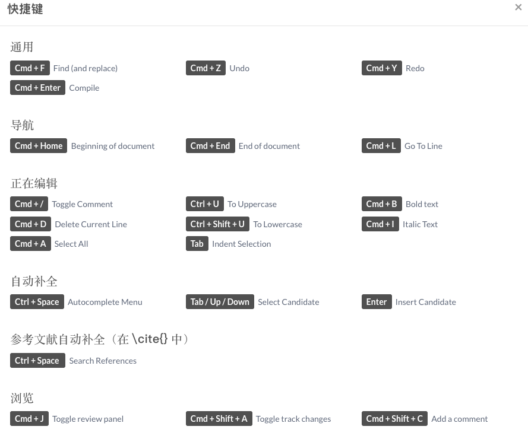
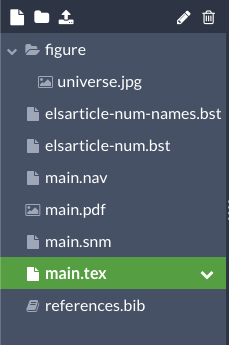
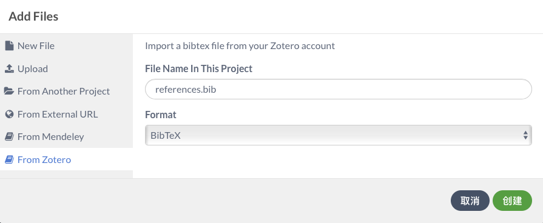
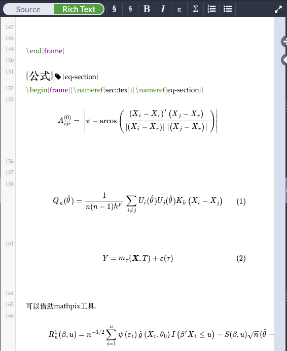
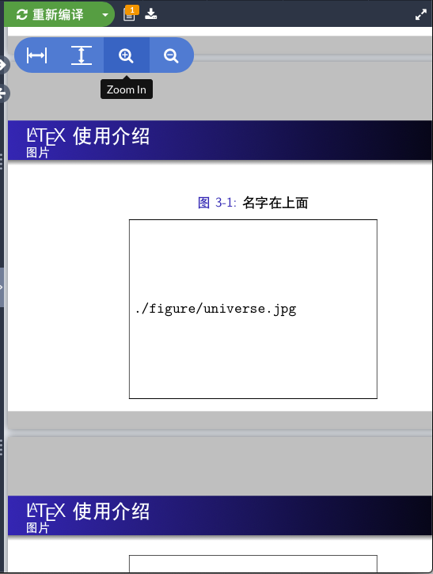
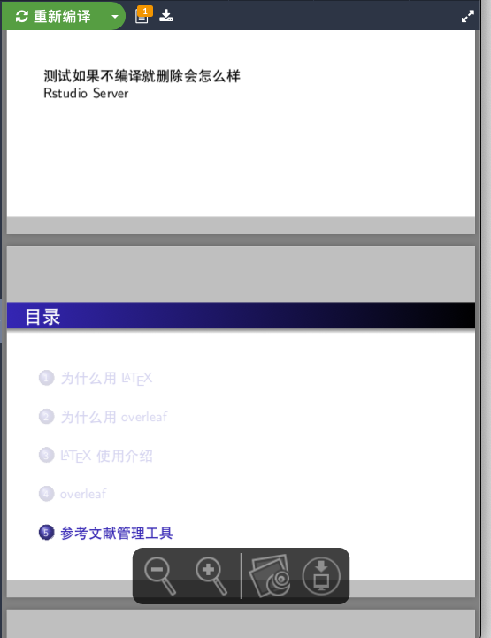
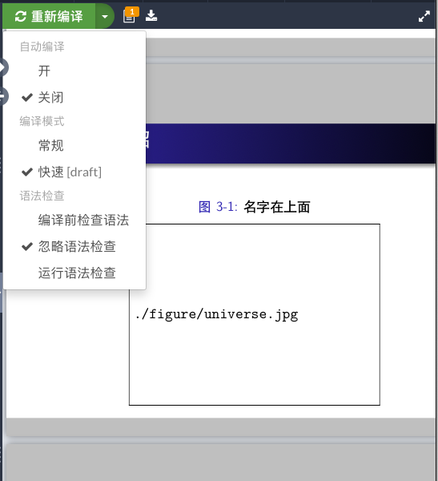

# 基本功能 {#basic}

创建项目之后,我们进入到项目的编辑界面,如下图所示:

大块的划分主要可以分成4部分,分别是左侧的 **文件目录(P1)**、中间的**tex源文件(P2)**、右侧的**pdf预览(P3)**以及最上面有一条**菜单栏**.

P1、P2之间的分界线上有一些图标,其中 拖动**三个点**可以调整不同区域的大小, 点击中间的 **向左的箭头**可以隐藏文件目录P1.
类似的,在P2、P3之间也有相应的图标,可以设置隐藏pdf.另外P2、P3之间上方还有两个双向的箭头.他们的功能是在源文件和pdf之间跳转.比如我想看正在编写的这一页对应的pdf什么效果,点击向右的箭头就可以跳转到左侧光标所在位置对应的pdf页面.向左的箭头类似,可以跳转到正在查看的pdf所对应的tex源文件的位置,方便修改时定位.

## 菜单栏 

菜单栏被项目名称从中间隔开,分成左右两部分.

其中右边 **共享**、**Submit**和**聊天**在第\@ref(intro)章已经介绍过,剩下的**浏览**和**历史版本**在\@ref(filehistory)节介绍.

关于左侧的菜单,**向上的箭头**用于退出当前项目,返回所有项目的列表.
点开**菜单**键,可以看到下面的结果:

### 下载 {#downloadsource}

如果需要下载tex源文件的话,只能从点开**菜单**下载.如果只是下载pdf的话,也可以点击右侧**P3**区域的下载图标.

### 执行

这里比较有用的可能只有 **字数统计** 功能,如下图:

**发布为模板**就是把当前的项目上传到Overleaf的模板库中.

**复制项目**就是复制一个相同的项目,比如我们通过链接打开别人分享的Overleaf模板,需要复制到自己的账户下使用.

### 同步

这里的功能需要订阅才能关联其他应用账号,主要在\@ref(sync)节介绍.

### 设置 {#set}

这里包括两部分设置,一部分是关于界面的个性化设置,比如字体、字号、界面主题等.另一部分是关于tex项目的设置,比如编译器,主目录等.

关于编译器的设置,简单讲,中文的文档设置XeLaTeX,英文文档设置pdfLaTeX.

(pdfLaTeX的编译效率会高一点,但是不支持中文.)

主目录在项目中有多个tex文件时需要设置,指定哪个文件是main.

### 快捷键
最下面有快捷键的说明,和常用的编辑器快捷键设置基本相同.

## 文件目录(P1)区域

当我们的文章需要插入很多图片、程序代码时,全在主目录下展开会显得比较乱.可以创建文件夹,用于存放文章中需要插入的材料.这就是这一区域的主要功能.

这一区域最上面有5个图标,下面是当前项目的文件目录结构.

5个图标从左开始,分别为:**新建文件,新建目录,上传,重命名,删除**.用于管理项目的文件结构.

(新建文件和上传点开都是这个界面 = =)

支持新建文件,上传文件,从链接下载以及从关联的账号直接导入.
在\@ref(refe)节会演示关联zotero后添加参考文献bib文件.

## tex源文件(P2)区域

这个区域主要用于输入内容,和tex客户端的主要区别是:
1.除了source之外,有一个Rich Text;
2.缺少了很多快捷插入的环境(目前只支持新建section、subsection,粗体,斜体,行内公式,行间公式,有序号枚举,无序号枚举).

另外,当我们开启右上角的 **浏览** 功能,这个区域会有所变化,在\@ref(filehistory)节介绍.

source和常用的客户端中的展示效果一样,只是纯文本的源文件.

Rich Text可以得到类似Word那种效果,可以在源文件中看到编译好的公式结果.像上面图中展示的.

## pdf预览(P3)区域

这一区域主要显示编译生成的pdf文件.最上面的3个菜单依次是 **编译模式设置**、**编译日志**、**下载pdf**.

如果只想下载pdf文件,不需要下载tex源文件,可以点击这一区域的下载图标.

如果在\@ref(set)的设置中,pdf阅读器使用的是浏览器内嵌的,想要调整视图大小,可以将鼠标移动到pdf页面的左上区域,像上面图中的样子.如果设置的是本机,在苹果系统下,需要将鼠标移动到中间偏下的位置设置视图大小,如下图:

编译模式的设置如下图:

**自动编译**:就是只要左侧的源文件有变动,会自动编译(流量党请慎重打开).

**编译模式**:快速[draft]模式会省略一些效果,只显示主要内容,加快编译的速度.比如图中beamer的超链接和图片都没有正常显示.平时修改内容的时候可以选择draft模式,减少编译等待的时间,最后需要生成文件的时候,记得修改到常规模式.

**语法检查**:如果比较熟悉LaTeX的语法,也可以关掉,提高编译的速度.

