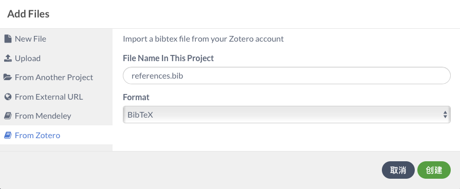

# 特色功能展示

前面介绍的都是tex客户端所具有的基本功能,这章介绍一下Overleaf的特别之处.

需要订阅的会提示说明.

## 文件同步 {#sync}

不说多人合作的情况,就自己一个人的话,可能也会有多台设备.在多台设备之间同步文章撰写进度,需要网盘或者随身带u盘.

Overleaf利用网页技术,可以很方便的实现不同账户、不同设备之间的文件进度同步.

### 个人本地和服务器同步

**需要订阅**

订阅后可以关联Dropbox账号和GitHub账号,实现本地文件和服务器上的文件同步.

如果合作项目中,有多人正在同时编辑内容,本地修改会和网页修改发生冲突.

Dropbox服务不能直接使用.

关联GitHub账号主要方便导入和发布模板,其他用途不大.

### 合作者之间同步

合作者都通过网页版访问的话,每个人修改的内容会实时更新到文件中.

## 合作编辑 {#collaborator}

**不同套餐合作者数量限制不一样**

收到别人的项目邀请后,进入项目列表界面: https://cn.overleaf.com/project

会看到横幅通知:

点击加入即可.之后这个项目会被归类到左侧 **与您共享的** 分类下.

在网页端,最上面可以看到正在这个项目中的人,像下面图中这样:

这时每个人的修改会被实时添加到项目中.

## 历史版本和修改记录 {#filehistory}

我们在写论文时,需要进行备份.比如最后论文完成时,可能会产生很多中间文件:XX第一版、XX第一版修改后...

这些Overleaf都可以帮我们保存,而且还可以实现类似Word修订模式的修改记录.

**免费账户只能查看24h内的记录**

订阅后,可以保留项目的所有历史版本,可以对比不同版本的差别(包括文件目录以及tex源文件).对于重要的版本,可以添加标签,方便后续查看.

**修改记录需要订阅**

下面这个界面可能很熟悉,借助网页技术,可以让LaTeX实现类似于Word修订模式的功能.

## 参考文献整合 {#refe}

LaTeX写作,添加参考文献最便于修改的方案是BibTeX.

https://liam.page/2016/01/23/using-bibtex-to-generate-reference/
这里有详细的介绍.

简单讲这样的好处是:

1.参考文献中只会罗列正文中引用过的条目;

2.参考文献的引用形式以及排列方式有单独的文件控制.

**需要订阅才能关联zotero账户或者Mendeley账户**

当我们关联好参考文献的账户之后,选择 文件目录区域的添加文件

文件名不一样不要在意,因为之前已经存在同名的文件了.

这样当我们在zotero账户中添加新的文献后,只要打开这个文件点击Refresh即可.

(不订阅的话只不过需要手动导出bib文件再上传即可)

